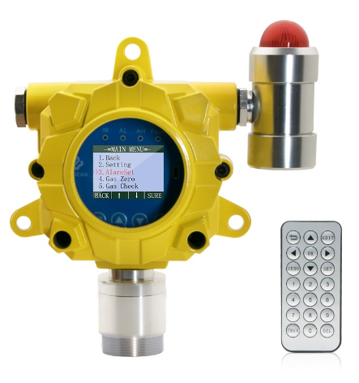
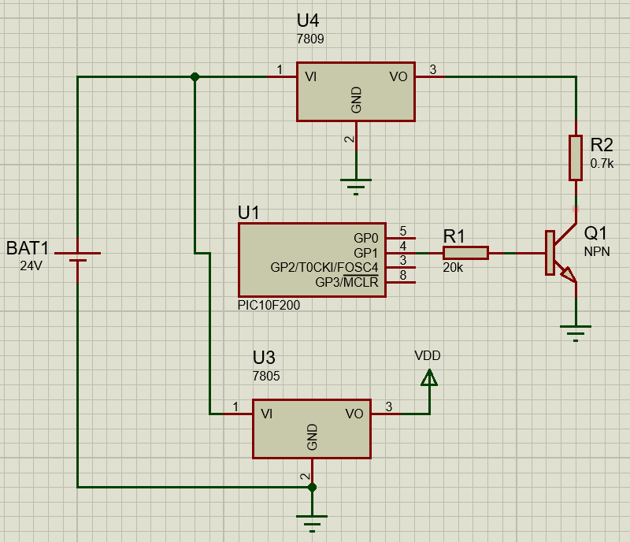
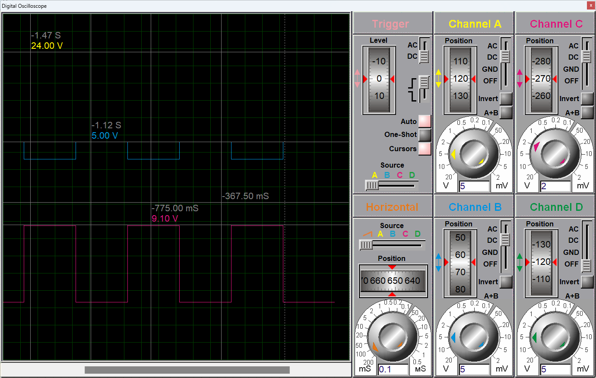
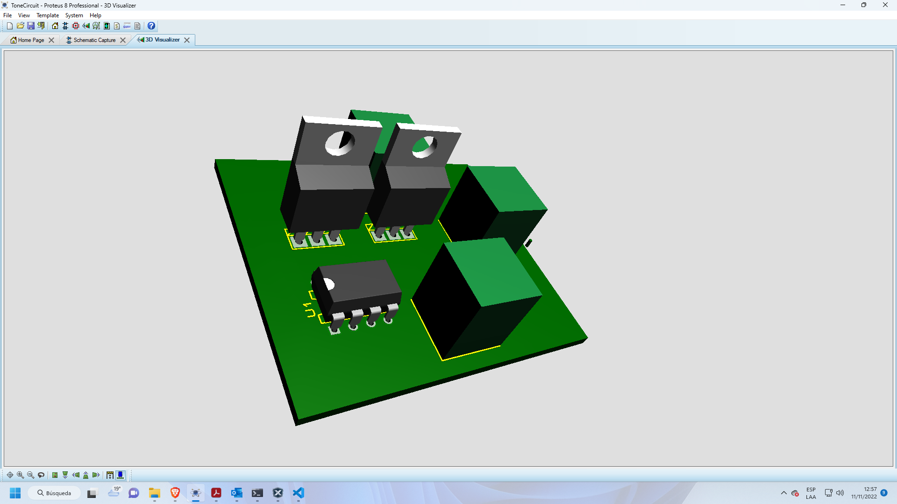

# Generador de tonos para el modelo KG-60  

  

Para la generación de una alarma dedicada en caso de problemas al momento de su activación se puede optar por una alarma dedicada y diseñada por el área de investigación y desarrollo.  

Circuito generador de tonos.

  

Señal de salida:

Amarillo: 24V  
Rosado: 9V  
Azul: 5V  

